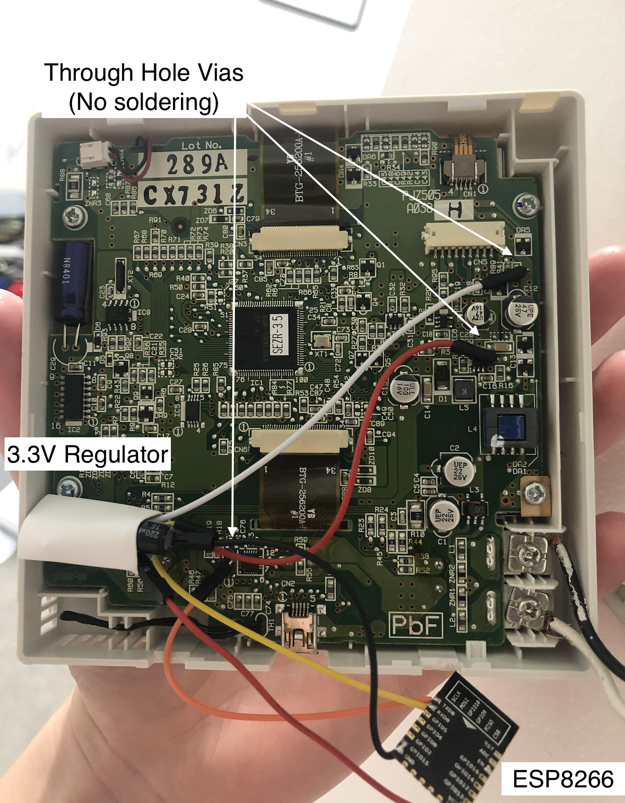
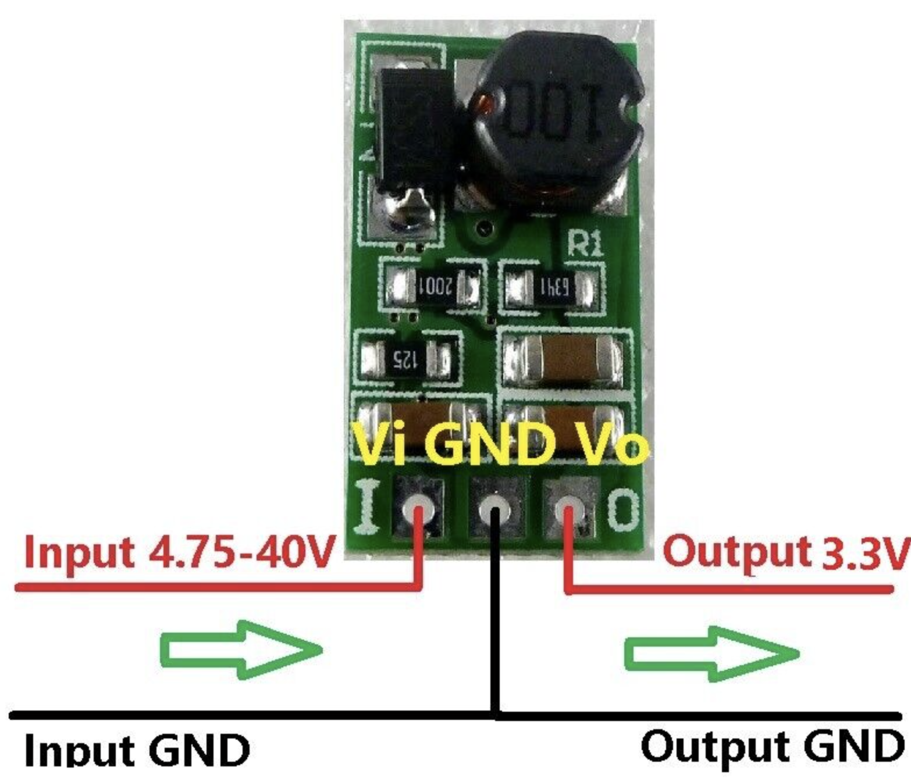
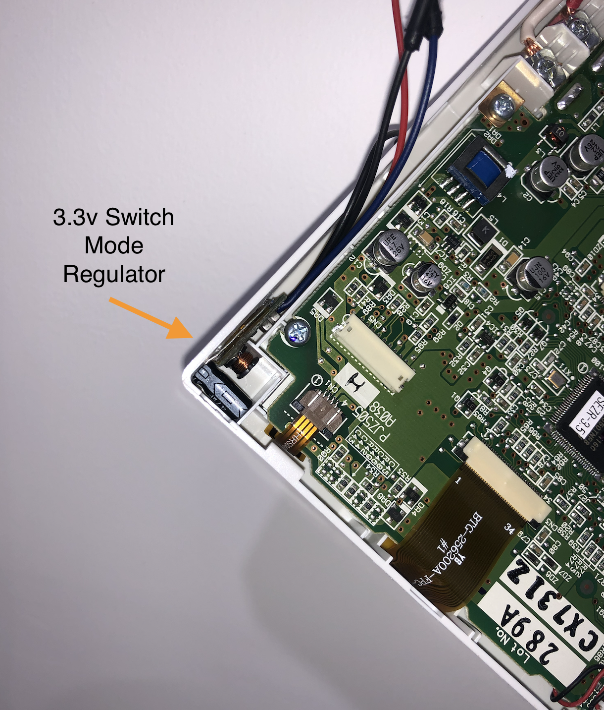
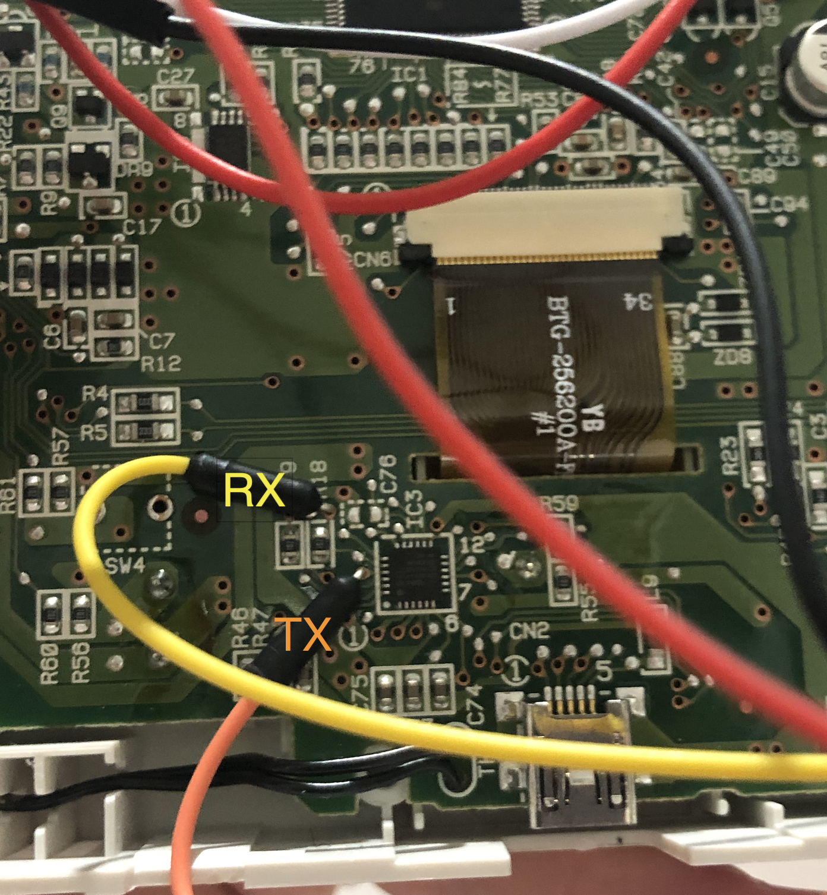
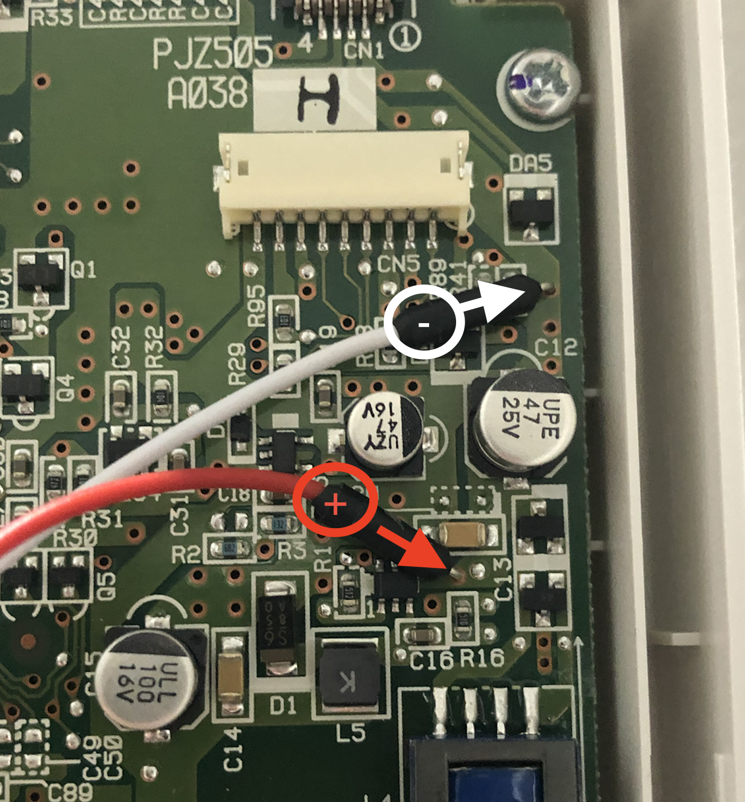

# Add Wifi to your Mitsubish RC-EX3 Air Conditioner 

Provides MQTT, web and HTTP API control of a Mitsubish RC-EX3 air conditioner panel.

This may also support a number of MHI HVAC controllers with a USB port.

This only requires a few breadboard jumper wires, a 3.3v buck converter and an ESP-12 (ESP826). The ESP-12 is recommended for its small size as it fits easily inside the existing enclosure, however any ESP8266 or ESP32 device could be used (tested on Seeed xiao and ESP Wroom). Linear regulators should be avoided to avoid overdrawing current and producing unwanted heat. A thermocouple is in the enclosure which should be kept away from the new components.

This is easy to install without any permanent modifications or soldering to the unit. This is done by inserting breadboard jumper pins into the through-hole vias on the board. The two components fit easily into the panel, however routing some wires can be easier with minor internal modifications to the plastic enclosure.

I have installed these in three units in my home and they have run flawlessly since Jan 2020 (over 4 years). They integrate with the rest of my bespoke home automation system (using homekit) and could be easily used unmodified, with the popular platforms of today.

# Home Assistant

Due to popular demand, the device advertises itself as a Home Assitant climate entity over MQTT. Enable this feature by building with `HA_DISCOVERY` defined in `config.h`. This also advertises the power off timer. Note these features are experemental.


# Setup

Wifi Manager will advertise an AP to connect to when uninitialised. 

Use this to set the: 
 - Wifi SSID
 - Wifi Password
 - MQTT topic
 - MQTT Server IP
 - MQTT username
 - MQTT password
 


# Web console


# MQTT

Fetch the device state with topic: `<device_topic>/state/get`

Set the device state with topic: `<device_topic>/state/set`

payload:
```
{
    "power": true/false,
    "mode": cool/dry/heat/fan/auto
    "speed": 0/1/2/3/4
    "temp": 16.0-30.0 
    "delayOffHours": 1-12
}
```

# Building

Clone this repository and open the project folder with [PlatformIO](https://platformio.org/). PIO will fetch all dependencies and build binaries for esp8266 and esp32.


# Building the hardware.

Flash the ESP with the firmware using a serial connection.

Prepare 4 wires to connect to the panels PCB (vcc, gnd, tx & rx). Using molded round pin (not the square dupont type) jumper wires, bend the pin on a 90 degree angle and cut off the excess wire, leaving a small stub. These fit snugly into the through-hole vias on the PCB.

Solder RX and RX jumper wires to the ESP-12.

Solder VCC and GND wires from the ESP-12 to the 3.3v Regulator. Depending on your regulator, I recommended adding a small electrolytic capacitor here.

[](image.png)


Solder ground and positive wires to the regultor. 

[](image.png)


Shrinkwrap all components to protect against any shorts.
Place the regulator into the void on the side of the enclusure. 
Press the jumper wire pins into the vias as shown.
The ESP-12 can sit flat against the PCB once sheilded with shrinkwrap.

[](image.png)


[](image.png)

[](image.png)

# Updating firmware

After building, use `esptool.py` from a terminal console within platformio:

`python3 espota.py --ip=<ESP8266 IP Address> --host_ip=0.0.0.0 --port=8266 --host_port=8267 --file=./.pio/build/d1_mini/firmware.bin --debug --progres`
